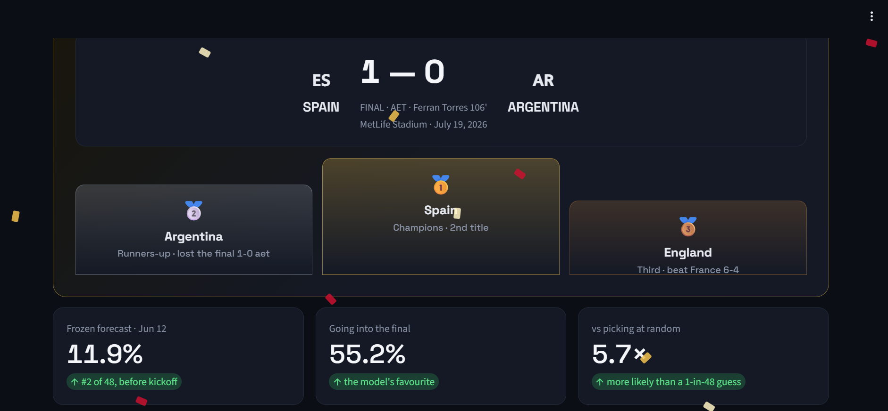
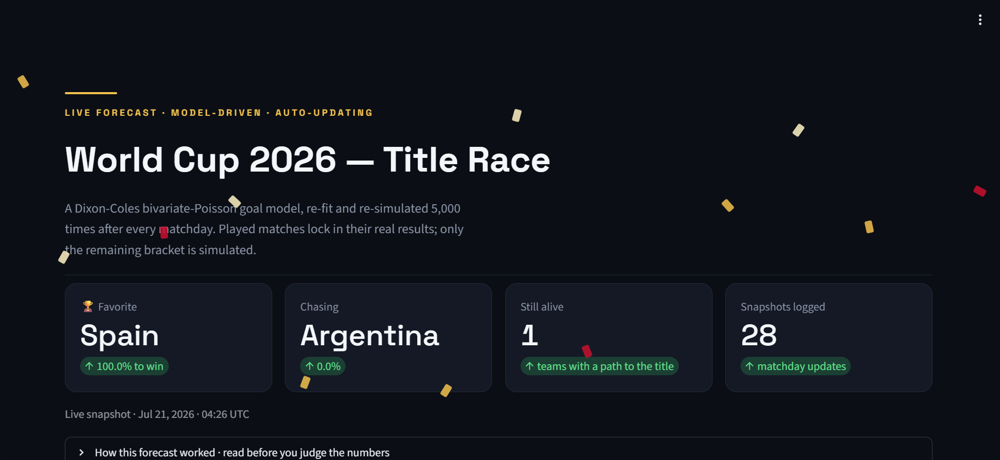
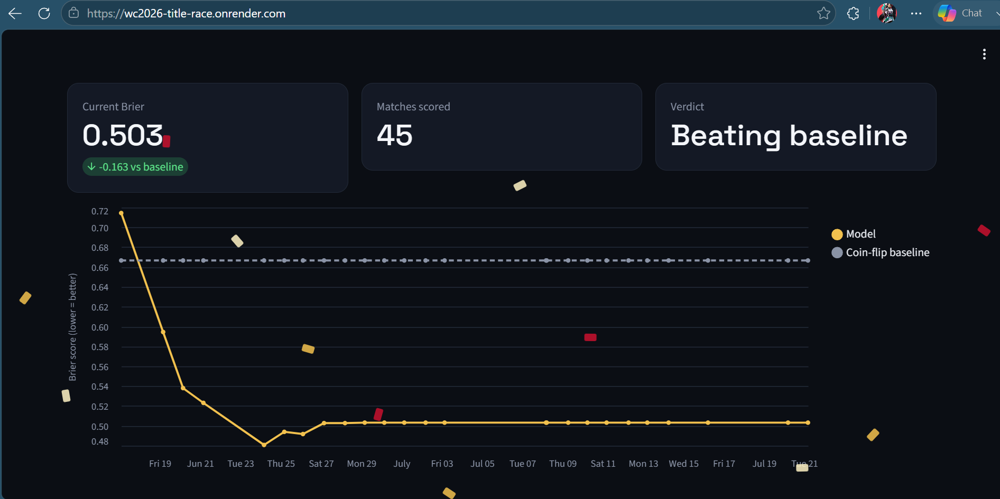
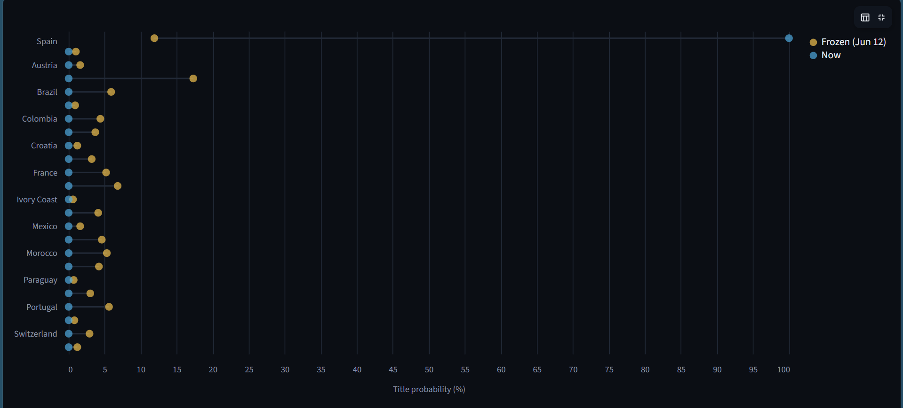
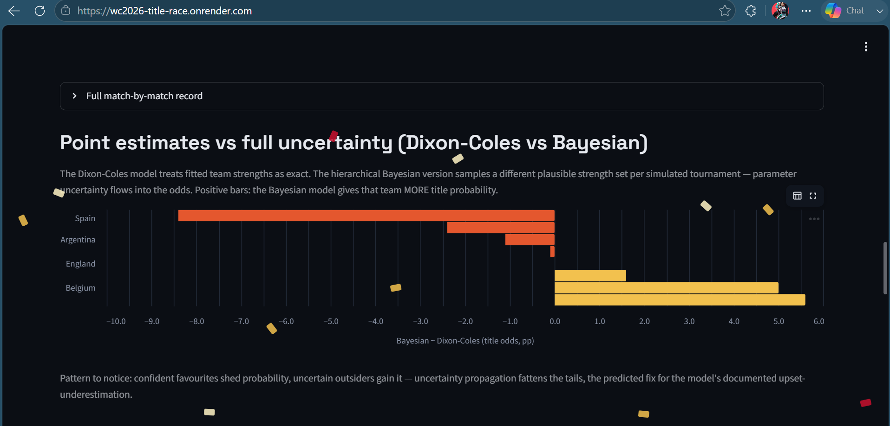
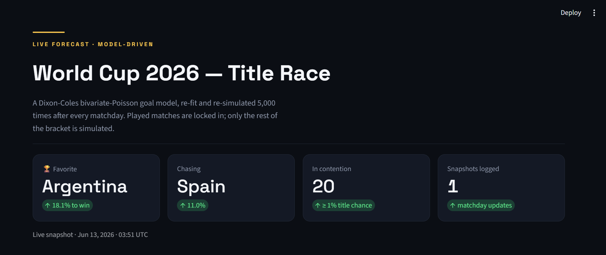
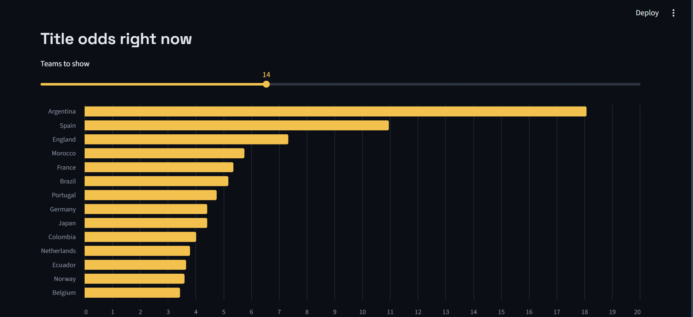
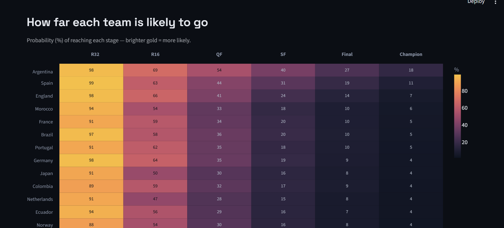

# ⚽ World Cup 2026 — Forecasting & Simulation

A statistical model that forecast the 2026 FIFA World Cup before it started,
ran live through all 104 matches, and graded itself against reality.

The forecast was frozen on June 12, 2026, before a ball was kicked, and
committed to git with a timestamp so it couldn't be edited afterwards. Then I
re-ran the whole pipeline every matchday until the final on July 19.

**How it did:** Spain won the tournament, beating Argentina 1-0 in extra time.
My frozen forecast had Spain ranked **#2 of 48 teams at 11.9%**, about 5.7x
what a random pick would give you. More importantly, the model liked Spain for
the exact reason they won: it rated their defence the best in the dataset, and
Spain lifted the trophy having conceded a single goal in eight matches, a
World Cup record. **All four actual semifinalists (Spain, Argentina, France,
England) were in the model's pre-tournament top eight.**

**▶️ [Live dashboard](https://wc2026-title-race.onrender.com)** — the finished
tournament, champion crowned, with the forecast's full record. (First load can
take ~30s while the free instance wakes up.)



| | |
|:---:|:---:|
|  |  |
|  |  |

*And how it looked while the tournament was still running:*

| | | |
|:---:|:---:|:---:|
|  |  |  |

---

## How it turned out

| | Result |
|---|---|
| Champion | **Spain** (1-0 aet vs Argentina, Ferran Torres 106') |
| Frozen forecast for Spain | 11.9%, ranked #2 of 48 |
| Model's #1 pick | Argentina (17.3%), lost the final |
| Semifinalists in the pre-tournament top 8 | **4 of 4** |
| Final live Brier score (45 scored matches) | **0.503** vs 0.667 coin-flip baseline |
| Final live log-loss | 0.846 vs 1.099 baseline |

The single favourite didn't win, and that's the honest headline. With 48 teams
and football's variance, no model reliably picks the outright winner. What a
good model does is put real, well-placed probability on what happens. This one
had the eventual champion second, for the correct reason, and had the entire
final four in its top eight before kickoff.

The live scoring tells the more interesting story. The model started the
tournament badly. Through the upset-heavy opening week it scored a Brier of
0.71, worse than a coin flip, and I'll admit that was uncomfortable to watch.
I didn't touch the model, because reacting to 11 matches is how you overfit.
As results accumulated it recovered steadily: 0.62, then 0.59, then 0.54, and
it finished at 0.503, comfortably ahead of the baseline. That whole arc is
charted on the dashboard's Model Lab tab. Being wrong early and right on
average is what a calibrated forecaster looks like.

---

## What the model predicted (frozen June 12)

Title odds from 5,000 simulations of the bracket, top 10, exactly as committed
before the tournament:

| Team        | Win the cup | Reach final | Reach semis |
|-------------|:-----------:|:-----------:|:-----------:|
| Argentina   | **17.3%**   | 26.2%       | 37.9%       |
| Spain       | **11.9%**   | 19.9%       | 31.0%       |
| England     | 6.8%        | 12.2%       | 22.2%       |
| Brazil      | 5.9%        | 11.4%       | 22.0%       |
| Portugal    | 5.6%        | 11.6%       | 20.6%       |
| Morocco     | 5.3%        | 10.2%       | 19.4%       |
| France      | 5.2%        | 10.2%       | 20.4%       |
| Germany     | 4.6%        | 9.5%        | 20.0%       |
| Colombia    | 4.4%        | 8.8%        | 16.9%       |
| Netherlands | 4.2%        | 8.2%        | 16.6%       |

Two calls worth revisiting now that we know the outcome.

**The defence thesis transferred.** The model made Argentina favourite because
of the best defensive rating in the field, with Spain right behind on the same
logic. The final was contested by the model's two most defensively rated
teams and decided 1-0 in extra time. The specific pick was one place off; the
mechanism was right.

**The France disagreement was a split decision.** Bookmakers had France as
favourite; my model had them 7th at 5.2%, partly because of a brutal group,
partly because the model can't see squad talent. France reached the
semifinals, better than my model's implied path but short of the market's
crown. I left the disagreement in before the tournament instead of tuning to
match the market, and I'd do that again. A model that diverges with reasons is
more useful than one that agrees by construction.

---

## Does it actually work? (Out-of-sample backtests)

Before trusting it on 2026, I backtested the pipeline on the last two World
Cups. For each one the model trained only on matches played before that
tournament started, then got scored on the real results. No future data leaks
into training.

| World Cup | Model Brier | Climatology | Uniform | Model log-loss |
|-----------|:-----------:|:-----------:|:-------:|:--------------:|
| 2018      | **0.566**   | 0.649       | 0.667   | 0.957          |
| 2022      | **0.614**   | 0.647       | 0.667   | 1.061          |

*(Lower is better. Climatology = historical win/draw/loss frequencies.
Uniform = a 1/3-1/3-1/3 guess.)*

It beats both baselines in both tournaments, and the live 2026 result (0.503)
ended up better than either backtest. The calibration analysis also exposed
the model's one systematic flaw: it underestimates upsets. Outcomes it priced
around 8% actually happened about 20% of the time. That is a known tendency of
Dixon-Coles style models, it showed up again in the live opening week, and it
motivated the Bayesian experiment below. The reliability diagram is in
[`reports/calibration.png`](reports/calibration.png).

---

## The live experiment

This part mattered as much as the modelling. From kickoff to the final, I
re-ran the pipeline by hand every matchday: pull the latest results, refit the
model, re-simulate the remaining bracket with played matches locked to their
real scores, log a snapshot, score every prediction the model had made before
each match, and push, which redeployed the dashboard. Twenty-eight snapshots
over five and a half weeks. Near the end I also wrote a scheduled GitHub
Actions job that does the same run automatically, so the system can maintain
itself, but most of the tournament was a daily manual habit.

Running it live surfaced a real bug, which I'm keeping in the story because
finding it is the point of building a dashboard. Midway through the knockouts
I noticed eliminated teams still showing small title odds. The cause: my
simulator assigned third-placed teams to bracket slots randomly (an
approximation of FIFA's allocation table), so some simulations played out a
bracket that never happened, letting knocked-out teams quietly advance. Once
the real Round of 32 existed in the data, I fixed it by reading the actual
pairings from the results and pinning every simulation to the true bracket.
Eliminated teams dropped to exactly zero. I found it by looking at my own
charts.

---

## Point estimates vs full uncertainty

The Dixon-Coles model treats its fitted team strengths as exact. The
hierarchical Bayesian version doesn't: every simulated tournament samples a
different plausible set of strengths from the posterior, so parameter
uncertainty flows into the title odds. Since the model's documented weakness
was underestimating upsets, this was a testable hypothesis: uncertainty
propagation should fatten the tails.

It did. Run side by side on the same conditioned bracket, the Bayesian version
moved probability away from the confident favourites (Spain -7.9 points at the
time of the comparison, Argentina -1.9) and toward the uncertain field
(Morocco +5.1, Belgium +2.4, and several outsiders gaining from zero). One
caveat I want on the record: the two models also differ in training window
(2015+ vs 2010+), so the comparison isn't perfectly clean. The direction and
breadth of the effect support the uncertainty story, but a matched-window
rerun is the right next step. The chart is on the dashboard's Model Lab tab.

---

## How it works

**Team strength (Elo).** A sequential rating with margin-of-victory scaling
and home advantage. Simple, interpretable, and a sanity check: the usual
heavyweights rise to the top.

**Scoreline model (Dixon-Coles).** The core. Each team gets a separate attack
and defence strength plus a home edge, and bivariate Poisson distributions
turn those into the probability of every possible scoreline, with the
Dixon-Coles correction for low-scoring games. A time-decay weight makes recent
matches count more. Fitted home advantage came out around 0.21 on the log
scale, roughly a 24% boost to scoring rate at home.

**Hierarchical Bayesian model (PyMC).** The same goal structure with partial
pooling, so rarely-seen teams shrink toward the average instead of getting
wild estimates, and full posteriors instead of point values. Home advantage
landed at 0.274 ± 0.033 with clean convergence (r-hat ≈ 1.00). Building it
also surfaced a data quirk: non-FIFA sides like the Isle of Man rate strangely
high because they barely share opponents with the main international pool, so
their ratings are poorly anchored. The model flags this itself through wide
uncertainty on those teams.

**Tournament simulation (Monte Carlo).** Plays the full 2026 bracket 5,000
times: 12 groups with the real tiebreakers, the eight best third-placed teams,
the official Round-of-32 layout, extra time and penalties in the knockouts,
and home advantage for the three hosts. During the tournament the simulation
conditioned on reality: played matches used their actual scores and shootout
winners, and once the real bracket was known, simulations were pinned to it.

---

## Dashboard & API

**Dashboard** (`streamlit run dashboard/app.py`) — three tabs. *Title Race*:
current odds, stage heatmap, trends, team explorer. *Model Lab*: the live
Brier chart, the model's best calls and biggest misses match by match, the
Bayesian comparison, backtests and calibration. *Forecast Story*: the frozen
June 12 odds against the final outcome. After the final it switched into a
champion mode, confetti included.

**API** (`uvicorn api.main:app`) — the model over REST:

| Endpoint | What it does |
|----------|--------------|
| `GET /predict?home=Brazil&away=France` | win/draw/loss probs + expected goals |
| `GET /odds?top=15` | title odds from the latest simulation |
| `GET /teams` | every team with its fitted ratings |
| `GET /health` | liveness check |

Interactive docs are auto-generated at `/docs`. Both services are
containerized (`Dockerfile`, `render.yaml`). The dashboard ships with a slim
dependency set (`requirements-dashboard.txt`) since it only serves
pre-computed CSVs; the API needs the full model stack.

---

## Project structure

```
fifa-wc2026-predictor/
├── src/
│   ├── data.py            # loading, cleaning, chronological splits
│   ├── elo.py             # Elo ratings
│   ├── dixon_coles.py     # bivariate Poisson scoreline model
│   ├── bayesian.py        # hierarchical Bayesian model (PyMC)
│   ├── bayesian_sim.py    # tournament sim with posterior uncertainty
│   ├── simulate.py        # Monte Carlo simulation of the 2026 bracket
│   ├── evaluate.py        # Brier / log-loss / calibration + backtests
│   ├── update.py          # live matchday update loop
│   └── postmortem.py      # frozen forecast vs the finished tournament
├── api/main.py            # FastAPI service
├── dashboard/app.py       # Streamlit dashboard (3 tabs)
├── tests/                 # pytest suite (probability axioms, sim coherence)
├── .github/workflows/     # scheduled daily update job
├── data/download_data.py
├── reports/               # frozen forecast, odds history, scores, post-mortem
├── Dockerfile · render.yaml · requirements*.txt
```

---

## Running it yourself

```bash
git clone https://github.com/mayur212626/fifa-wc2026-predictor.git
cd fifa-wc2026-predictor

python -m venv venv
venv\Scripts\Activate.ps1        # Windows  (macOS/Linux: source venv/bin/activate)
pip install -r requirements.txt

python data/download_data.py     # fetch the match data
python -m src.simulate           # run the tournament simulation
python -m src.postmortem         # score the frozen forecast vs reality
streamlit run dashboard/app.py   # open the dashboard
```

Tests run with `pytest -q`.

---

## What it can't do

Football is high-variance and one tournament is a tiny sample. A 17% favourite
loses the title most of the time, and this one did. The model only knows match
results: no injuries, no lineups, no sense of individual talent, which is a
real gap against the betting market. Penalty shootouts are modelled as a coin
flip (close to true empirically, but a simplification). And the tail problem
is real: both the backtests and the live opening week showed the point-estimate
model underrating upsets, which the Bayesian version only partially softens.
These aren't disclaimers to hide behind. Knowing exactly where the model fails
is most of what I learned building it.

---

## Tech stack

Python · pandas · NumPy · SciPy · statsmodels · PyMC · ArviZ · scikit-learn ·
Altair · Streamlit · FastAPI · pytest · Docker · GitHub Actions

## Data & credit

Match data from the [International football results 1872–present](https://github.com/martj42/international_results)
dataset by Mart Jürisoo, used under its license. It covers every men's full
international, which keeps the training data clean.

## License

Released under the MIT License. Free to use, modify, and share with
attribution. See [`LICENSE`](LICENSE). © 2026 Mayur Patil.
