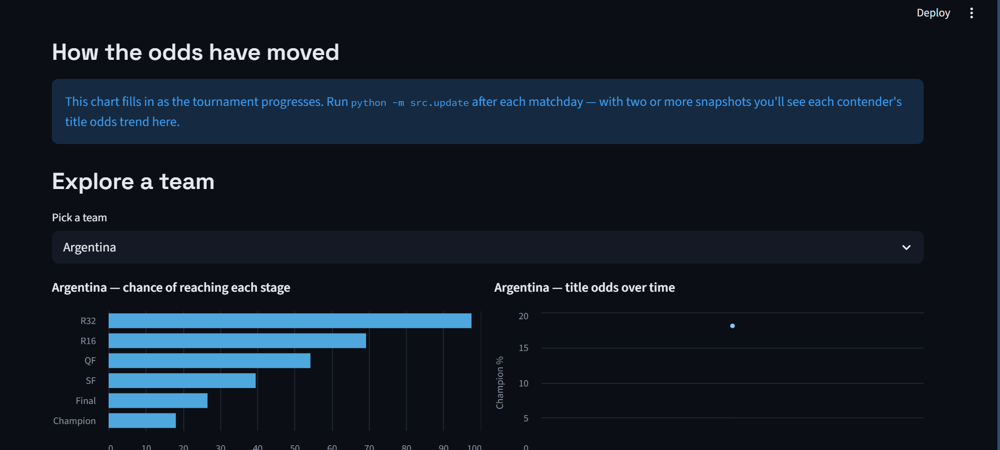

# ⚽ World Cup 2026 — Forecasting & Simulation

Predicting the 2026 FIFA World Cup with a goal-based statistical model and a
Monte Carlo simulation of the full 48-team bracket — backtested on past
tournaments, benchmarked against baselines, and served through a live
dashboard and an API.

I wanted a real answer to "who's actually going to win?" — not a gut take, but
a number that comes from how teams have actually played. So I built a model
that learns each team's attacking and defensive strength from ~16,000
international matches, then simulates the entire tournament thousands of times
to turn those strengths into title odds.

The forecast in this repo was **frozen before the tournament kicked off** (data
cutoff June 8, 2026 — see [`reports/forecast_2026.md`](reports/forecast_2026.md)).
That timestamp matters: these are genuine predictions, not hindsight.


| | |
|:---:|:---:|
|  |  |
|  | |

*The live title-race dashboard, built with Streamlit. Run it locally with
`streamlit run dashboard/app.py`.*

---

## What the model predicted

Title odds from 5,000 simulations of the bracket (top 12):

| Team        | Win the cup | Reach final | Reach semis |
|-------------|:-----------:|:-----------:|:-----------:|
| Argentina   | **17.3%**   | 26.2%       | 37.9%       |
| Spain       | **11.9%**   | 19.9%       | 31.0%       |
| England     | 6.8%        | 12.2%       | 22.2%       |
| Brazil      | 5.9%        | 11.4%       | 22.0%       |
| Portugal    | 5.6%        | 11.6%       | 20.6%       |
| Morocco     | 5.3%        | 10.2%       | 19.4%       |
| France      | 5.2%        | 10.2%       | 20.4%       |
| Germany     | 4.6%        | 9.5%        | 20.0%       |
| Colombia    | 4.4%        | 8.8%        | 16.9%       |
| Netherlands | 4.2%        | 8.2%        | 16.6%       |

Two things stood out to me here:

**Argentina come out on top because of their defense, not their attack.** In
the fitted ratings they're middling going forward but have the best defensive
rating in the dataset by a clear margin — and a strong defense compounds across
seven knockout rounds, because you just keep not losing. A soft group
(Algeria, Austria, Jordan) helps too.

**The model disagrees with the betting market on France.** Bookmakers had
France as the favorite; my model has them 7th. Part of that is real — they
drew the hardest group — and part is a known blind spot: the model only sees
results, so it has no idea about squad depth or individual talent. I left this
disagreement in on purpose. A model that honestly diverges from the market,
with reasons, is more interesting than one tuned to agree.

---

## Does it actually work? (Out-of-sample backtests)

A forecast is only worth anything if it's calibrated, so I backtested the whole
pipeline on the last two World Cups. For each one, the model was trained on
**only** the matches played before that tournament started, then scored on the
real results — no future data leaking in.

| World Cup | Model Brier | Climatology | Uniform | Model log-loss |
|-----------|:-----------:|:-----------:|:-------:|:--------------:|
| 2018      | **0.566**   | 0.649       | 0.667   | 0.957          |
| 2022      | **0.614**   | 0.647       | 0.667   | 1.061          |

*(Brier and log-loss: lower is better. Climatology = historical win/draw/loss
frequencies; uniform = a 1/3-1/3-1/3 guess.)*

The model beats both baselines in both tournaments. It's stronger in 2018 than
2022 — which makes sense, because 2022 was one of the most upset-heavy World
Cups ever (Saudi Arabia over Argentina, Japan beating Germany *and* Spain,
Morocco to the semis). Every public model had a rough time that year.

On calibration, pooling all 128 backtest matches, the mid-range buckets are
honest — when the model said ~31%, those outcomes happened ~30% of the time;
when it said ~70%, they happened ~68%. The one real flaw is in the tail: the
model **underestimates upsets**, calling some longshots ~8% when they actually
came in around 20%. That's a known Dixon-Coles tendency, and it's exactly what
the Bayesian version (with its wider parameter uncertainty) is meant to soften.
The reliability diagram is in [`reports/calibration.png`](reports/calibration.png).

---

## How it works

The pipeline goes from raw match history to title odds in a few layers, each
building on the last:

**Team strength (Elo).** A simple, interpretable rating built sequentially from
match results, with margin-of-victory scaling and home advantage. Good as a
baseline and a sanity check — the usual heavyweights rise to the top.

**Scoreline model (Dixon-Coles).** The core. Instead of just rating teams, it
estimates a separate attack and defense strength for every team plus a home
edge, then uses bivariate Poisson distributions to give the probability of
every possible scoreline — with the Dixon-Coles correction for low-scoring
games. A time-decay weight makes recent matches count more than old ones.
(Fitted home advantage came out at ~0.21 on the log scale — about a 24% boost
to scoring rate at home.)

**Bayesian version (PyMC).** A hierarchical Bayesian take on the same goal
model, with partial pooling so rarely-seen teams get shrunk toward the average
instead of getting wild estimates, and full posterior distributions so you can
see how *uncertain* each rating is. Home advantage here landed at 0.274 ± 0.033
with healthy convergence (r-hat ≈ 1.0). Building this also surfaced a nice data
quirk: non-FIFA sides like Isle of Man rate weirdly high because they barely
share opponents with the main international pool, so their ratings are poorly
anchored — the model flags this itself through wide uncertainty.

**Tournament simulation (Monte Carlo).** Plays the whole 2026 bracket 5,000
times: 12 groups with the real tiebreakers, the eight best third-placed teams,
the official Round-of-32 layout, extra time and penalties in the knockouts, and
home advantage for the three hosts. Counting how often each team reaches each
stage gives the odds.

**Going live.** During the tournament, an update loop re-downloads results,
refits the model, and re-simulates — but conditioned on what's actually
happened: played matches lock in their real scores (and real shootout winners),
and only the remaining bracket is simulated. Every run logs a snapshot so you
can watch the odds move match by match, and scores the model's pre-match calls
against reality.

---

## Live dashboard & API

**Dashboard** (`streamlit run dashboard/app.py`) — a dark, broadcast-style view
of the title race: current odds, a stage-by-stage heatmap, how each team's odds
have moved across the tournament, and a per-team explorer.

**API** (`uvicorn api.main:app`) — the model served over REST:

| Endpoint | What it does |
|----------|--------------|
| `GET /predict?home=Brazil&away=France` | win/draw/loss probs + expected goals |
| `GET /odds?top=15` | current title odds |
| `GET /teams` | every team with its ratings |
| `GET /health` | liveness check |

Interactive docs are auto-generated at `/docs`.

Both are containerized (`Dockerfile`, `render.yaml`) for one-click deployment.
The dashboard uses a slim dependency set (`requirements-dashboard.txt`) since it
only serves pre-computed CSVs — the API needs the full model stack.

---

## Project structure

```
fifa-wc2026-predictor/
├── src/
│   ├── data.py          # loading, cleaning, chronological splits
│   ├── elo.py           # Elo ratings
│   ├── dixon_coles.py   # bivariate Poisson scoreline model
│   ├── bayesian.py      # hierarchical Bayesian model (PyMC)
│   ├── simulate.py      # Monte Carlo simulation of the 2026 bracket
│   ├── evaluate.py      # Brier / log-loss / calibration + backtests
│   └── update.py        # live update loop during the tournament
├── api/main.py          # FastAPI service
├── dashboard/app.py     # Streamlit dashboard
├── tests/               # pytest suite (probability axioms, sim coherence)
├── data/download_data.py
├── reports/             # forecast, simulation output, backtest results
├── Dockerfile · render.yaml · requirements*.txt
```

---

## Running it yourself

```bash
git clone https://github.com/mayur212626/fifa-wc2026-predictor.git
cd fifa-wc2026-predictor

python -m venv venv
venv\Scripts\Activate.ps1        # Windows  (macOS/Linux: source venv/bin/activate)
pip install -r requirements.txt

python data/download_data.py     # fetch the match data
python -m src.simulate           # run the tournament simulation
streamlit run dashboard/app.py   # open the dashboard
```

Run `python -m src.update` once a day during the tournament to refresh the odds.
Tests run with `pytest -q`.

---

## What it can't do

Worth being honest about the limits. Football is high-variance, and a single
tournament is a tiny sample — a 17% favorite still loses the title 83% of the
time, so don't read these as predictions of certainty. The model only knows
match results: it has no concept of injuries, current form, lineups, or how good
a squad's individual players are, which is a real gap against the betting
market. Penalty shootouts are modeled as a coin flip (close to true empirically,
but a simplification), and the deployed dashboard shows a snapshot that updates
when I commit new data, not a fully automated live feed.

---

## Tech stack

Python · pandas · NumPy · SciPy · statsmodels · PyMC · ArviZ · scikit-learn ·
Altair · Streamlit · FastAPI · pytest · Docker

---

## Data & credit

Match data from the [International football results 1872–present](https://github.com/martj42/international_results)
dataset by Mart Jürisoo, used under its license. It covers every men's full
international, which keeps the training data clean.

## License

Released under the MIT License — free to use, modify, and share with
attribution. See [`LICENSE`](LICENSE). © 2026 Mayur Patil.
